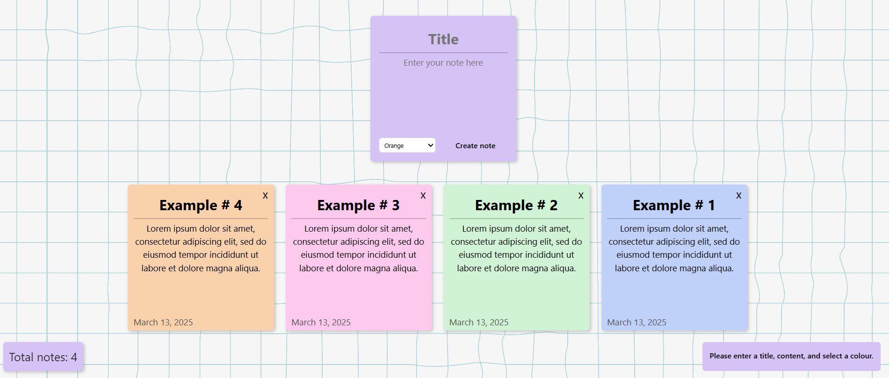

## Sticky Notes

This is the third for Object Oriented Javascript, a notes app. 
Below is a screenshot of how it is aligned on my browser.

Here are some examples I found before starting the project. 

